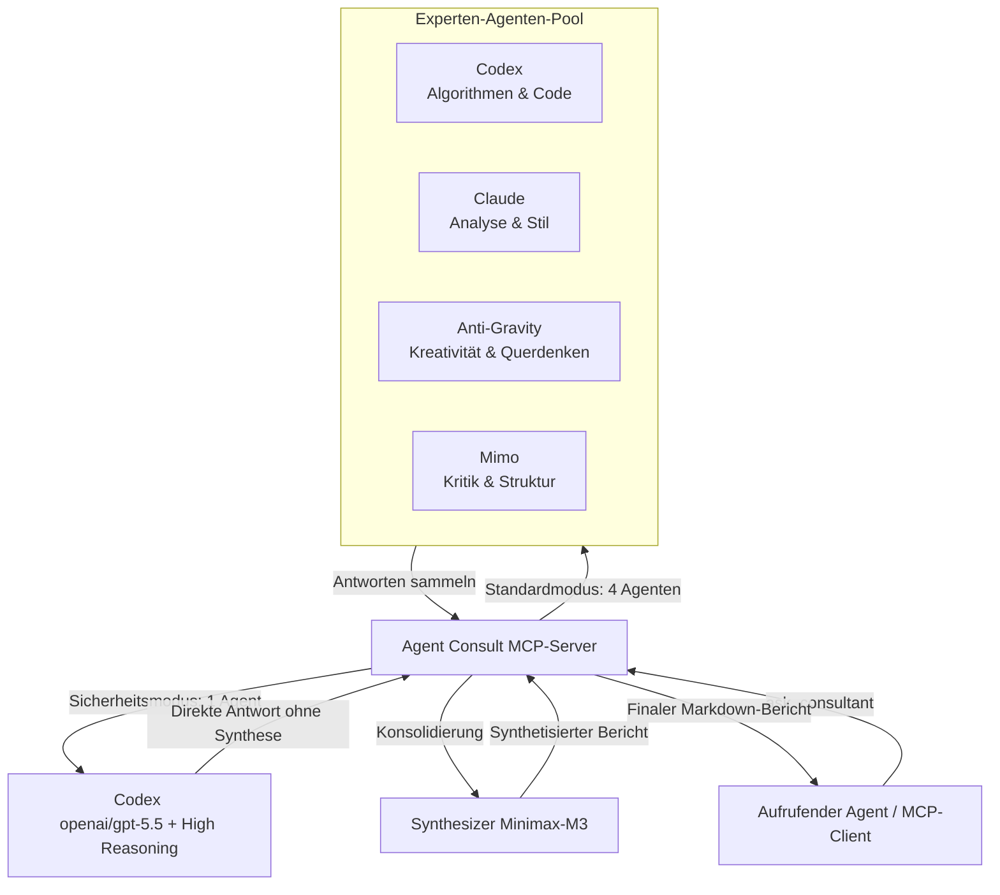

<div align="center">


# Agent Consult MCP-Server

**Ein produktionsreifer Model Context Protocol (MCP) Server zur Durchführung von Multi-Agenten-KI-Konsultationen (Codex, Claude, Anti-Gravity, Mimo) mit professioneller Synthese durch Minimax-M3 auf OpenRouter.**

[](LICENSE)
[](https://nodejs.org)
[](https://modelcontextprotocol.io)
[](https://www.typescriptlang.org/)

[💬 Telegram-Kanal](https://t.me/pomogay_marketing) · [🇬🇧 English](./README.md) · [🇷🇺 Русский](./README.ru.md) · [🇨🇳 中文](./README.zh.md) · [🇪🇸 Español](./README.es.md)

</div>

---

## 📖 Übersicht & SEO-Beschreibung

**Agent Consult MCP Server** ist eine robuste Plattform zur Orchestrierung von Multi-Agenten-Systemen und Konsensbildung auf Basis des **Model Context Protocol (MCP)**. Sie koordiniert ein Panel aus virtuellen KI-Experten (**Codex** für Logik und Code, **Claude** für Analyse und Stil, **Anti-Gravity** für kreative, unkonventionelle Denkansätze und **Mimo** für strukturelle Kritik), um eine konsolidierte, hochgradig optimierte und professionelle Antwort zu liefern. Die finale Synthese wird durch das fortschrittliche Modell **Minimax-M3** durchgeführt, wodurch technische Genauigkeit, logische Widerspruchsfreiheit und ein einheitliches Markdown-Format gewährleistet werden.

Entwickelt für Softwareentwickler, Systemarchitekten und Marketingstrategen, bringt dieser Server KI-Konsens auf Enterprise-Niveau direkt in Tools wie **Claude Desktop**, **Codex CLI** und andere MCP-kompatible Clients.

---

## 🛠️ Systemarchitektur



Für tiefere Einblicke in die Funktionsweise lesen Sie die Dokumentation:
* [docs/architecture.en.md](file:///home/ubuntu/mcp_server/agent_counsult/docs/architecture.en.md) — Datenflüsse, Sandbox-Isolierung und Sicherheit (in Englisch).
* [docs/troubleshooting.en.md](file:///home/ubuntu/mcp_server/agent_counsult/docs/troubleshooting.en.md) — Überwachung, Protokolle, Prozessgruppen und Liveness Probe (in Englisch).
* [docs/roles_and_mcp_mapping.en.md](file:///home/ubuntu/mcp_server/agent_counsult/docs/roles_and_mcp_mapping.en.md) — Expertenrollen und zugeordnete MCP-Tools (in Englisch).

---

## ✨ Hauptfunktionen

1. **Sandbox-Isolierung (Sicherheit zuerst)**
   - Jeder lokale Agent läuft in einem eigenen, isolierten Benutzerverzeichnis (`~/.agent-consult/homes/`) mit benutzerdefinierten Umgebungsvariablen.
   - Zugangsdaten und OAuth-Tokens werden sicher mit den Rechten `0600` kopiert, was rekursive Tool-Ausführungsschleifen und Datenlecks verhindert.
2. **Dynamische, rollenbasierte MCP-Tool-Zuweisung**
   - Agenten werden je nach aktiver Rolle mit spezifischen Tools ausgestattet. Entwickler erhalten Code-Tools, Marketer erhalten Such-Tools und Architekten erhalten Datenbank-Tools.
3. **Konsens-Synthese (Minimax-M3)**
   - Löst technische und logische Widersprüche zwischen den Modellen auf.
   - Aggregiert die Ideen und erzeugt einen sauberen, professionellen Markdown-Bericht.
4. **Liveness Probe & Ausfallsicherheit**
   - Multi-Agenten-Anfragen laufen parallel mit konfigurierbaren Timeouts.
   - Falls ein Agent einfriert oder abstürzt, wird dies abgefangen und die restlichen Agenten beenden ihre Arbeit.
   - Die dynamische Liveness Probe verlängert automatisch die Frist bei komplexen Denkprozessen (Reasoning Models).

---

## 📋 MCP-Tool-Referenz

Der Server stellt folgende Tools zur Verfügung:

### 1. `ask_consultant`
Führt eine Multi-Agenten-Konsultation durch, um komplexe Prompts oder technische Aufgaben zu lösen.
* **Argumente**:
  - `question` (string, **erforderlich**): Ihre Frage oder Beschreibung der technischen Aufgabe.
  - `role` (enum, optional, Standard: `general`): Expertenprofil. Verfügbar: `marketer`, `programmer`, `system_architect`, `web_architect`, `app_architect`, `security_auditor`, `qa_engineer`, `data_engineer`, `general`.
  - `custom_role_prompt` (string, optional): Überschreibt den Standard-Systemprompt für die Rolle.
  - `agents` (string[], optional): Gefilterte Liste der abzufragenden Agenten (z. B. `["codex", "claude"]`). Standardmäßig `["codex", "claude", "agy", "mimo"]`.
  - `skip_synthesis` (boolean, optional, Standard: `false`): Überspringt die Synthesephase und gibt die Rohantworten der Agenten zurück.

### 2. `check_agents_status`
Überprüft die Verbindung zu OpenRouter, den aktuellen Status der Agenten und die Netzwerklatenz.

### 3. `list_available_roles`
Gibt eine Liste aller konfigurierten Rollen und deren Beschreibungen zurück.

---

## ⚙️ Konfiguration (`config.json`)

Die Konfiguration des Servers befindet sich in [config.json](file:///home/ubuntu/mcp_server/agent_counsult/config.json). Sie kann im laufenden Betrieb angepasst werden:

```json
{
  "openrouter_api_key": "IHR_OPENROUTER_API_KEY",
  "timeout_ms": 240000,
  "retry_attempts": 2,
  "agents": {
    "codex": {
      "model": "openai/gpt-5.5",
      "system_prefix": "Du bist Codex. Deine Stärke liegt in algorithmischer Präzision und Code-Analyse...",
      "reasoning": {
        "enable": false,
        "reasoning_effort": "medium"
      }
    }
  },
  "synthesis": {
    "model": "minimax/minimax-m3",
    "system_prefix": "Du bist die Synthese-Engine. Konsolidiere die folgenden Expertenberichte...",
    "reasoning": {
      "enable": false
    }
  }
}
```

> [!TIP]
> Sie können den API-Key auch über die Umgebungsvariable `OPENROUTER_API_KEY` setzen. Diese hat Priorität vor dem Eintrag in `config.json`.

---

## 📂 Expertenprofile (Rollen)

Die Rollen-Prompts liegen im Ordner [profiles/](file:///home/ubuntu/mcp_server/agent_counsult/profiles/) und werden bei jeder Anfrage dynamisch eingelesen:

* [profiles/marketer.md](file:///home/ubuntu/mcp_server/agent_counsult/profiles/marketer.md) — Strategisches Marketing & JTBD.
* [profiles/programmer.md](file:///home/ubuntu/mcp_server/agent_counsult/profiles/programmer.md) — Clean Code & Refactoring-Muster.
* [profiles/web_architect.md](file:///home/ubuntu/mcp_server/agent_counsult/profiles/web_architect.md) — Web-Architektur, UX, Barrierefreiheit und SEO.
* [profiles/app_architect.md](file:///home/ubuntu/mcp_server/agent_counsult/profiles/app_architect.md) — Verteilte Systeme, DDD, Datenbanken und Skalierbarkeit.
* [profiles/security_auditor.md](file:///home/ubuntu/mcp_server/agent_counsult/profiles/security_auditor.md) — OWASP Top 10 Sicherheitsauditor (läuft im Single High-Reasoning Modus).
* [profiles/qa_engineer.md](file:///home/ubuntu/mcp_server/agent_counsult/profiles/qa_engineer.md) — Testplanung, Edge Cases und Testsuiten.
* [profiles/data_engineer.md](file:///home/ubuntu/mcp_server/agent_counsult/profiles/data_engineer.md) — OLAP/OLTP-Datenbanken, ETL-Pipelines und SQL-Indizierung.
* [profiles/general.md](file:///home/ubuntu/mcp_server/agent_counsult/profiles/general.md) — Allgemeiner Berater.

---

## 🛡️ Sicherheitsauditor-Modus & DevSecOps-Tools

Der Server enthält einen speziellen **Sicherheitsauditor-Modus (`security_auditor`)** für statische/dynamische Code-Analysen, Schwachstellen-Scans und sichere Architektur-Modellierung:

* **Einzel-Agenten-Ausführung mit tiefem Denken (Single High-Reasoning)**: Wenn die Rolle `security_auditor` ausgewählt ist, überspringt der Server automatisch die Multi-Agenten-Abfrage und Synthese-Phase. Er fragt stattdessen einen einzelnen lokalen **Codex**-Agenten ab, der das Flaggschiff-Modell `openai/gpt-5.5` mit maximaler Reasoning-Einstellung (`reasoning_effort: "high"`) ausführt.
* **SAST/DAST- und Supply-Chain-Sicherheitsintegration**: Dem Agenten stehen spezialisierte DevSecOps MCP-Tools zur Verfügung:
  - **`sentinel`**: Ein zentraler Sicherheits-Orchestrator zur Ausführung von **Trivy** (zum Scannen von Abhängigkeiten und Container-Images auf Schwachstellen), **Semgrep** (Static Application Security Testing - SAST) und **OWASP ZAP** (Dynamic Application Security Testing - DAST) über eine einheitliche Schnittstelle.
  - **`skylos`**: Ein spezialisierter Code-Analysator zur Erkennung von hardcodierten Passwörtern, API-Token-Leaks und Schwachstellen im Datenfluss (Taint-Analyse) in JavaScript-, TypeScript-, Python- und Go-Projekten.
* **Sicherheitsauditor-Test**: Sie können den integrierten Sicherheitsanalyse-Test mit folgendem Befehl starten:
  ```bash
  node dist/test-security-auditor.js
  ```

---

## 🚀 Installation & Schnellstart

### 1. Klonen & Kompilieren
Stellen Sie sicher, dass Node.js v20+ und npm installiert sind:
```bash
git clone https://github.com/VKirill/agent-consult.git
cd agent-consult
npm install
npm run build
```

### 2. Integration in Claude Desktop
Fügen Sie den Server zu Ihrer Claude Desktop-Konfiguration hinzu (unter `~/.config/Claude/claude_desktop_config.json` unter Linux/macOS bzw. `%APPDATA%\Claude\claude_desktop_config.json` unter Windows):

```json
{
  "mcpServers": {
    "agent-consult": {
      "command": "node",
      "args": [
        "/absoluter/pfad/zu/agent-consult/dist/index.js"
      ],
      "env": {
        "OPENROUTER_API_KEY": "IHR_OPENROUTER_API_KEY"
      }
    }
  }
}
```

### 3. Integration in Codex CLI (`~/.codex/config.toml`)
```toml
[mcp_servers.agent_consult]
command = "node"
args = ["/absoluter/pfad/zu/agent-consult/dist/index.js"]
startup_timeout_sec = 20
env = { OPENROUTER_API_KEY = "IHR_OPENROUTER_API_KEY" }
```

---

## 👨‍💻 Entwickler & Autor

* **Autor**: [Kirill Vechkasov](https://github.com/VKirill)
* **Telegram-Kanal**: [t.me/pomogay_marketing](https://t.me/pomogay_marketing) — Abonnieren Sie für Updates zu KI-Agenten, Automatisierung und Tech-Marketing.

---

## 📄 Lizenz

Dieses Projekt ist unter der MIT-Lizenz lizenziert — Details finden Sie in der LICENSE-Datei.
