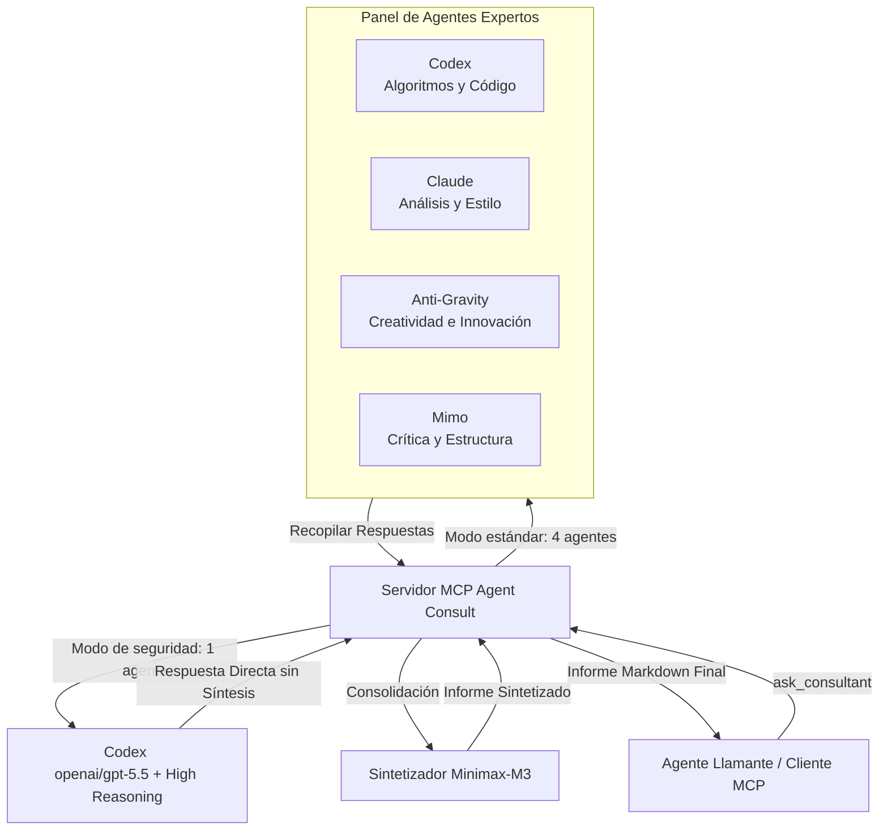

<div align="center">


# Servidor MCP Agent Consult

**Un servidor de Model Context Protocol (MCP) de nivel de producción para ejecutar consultas multi-agente de IA (Codex, Claude, Anti-Gravity, Mimo) con síntesis profesional impulsada por Minimax-M3 en OpenRouter.**

[](LICENSE)
[](https://nodejs.org)
[](https://modelcontextprotocol.io)
[](https://www.typescriptlang.org/)

[💬 Canal de Telegram](https://t.me/pomogay_marketing) · [🇬🇧 English](./README.md) · [🇷🇺 Русский](./README.ru.md) · [🇨🇳 中文](./README.zh.md) · [🇩🇪 Deutsch](./README.de.md)

</div>

---

## 📖 Descripción general y Optimización SEO

**Agent Consult MCP Server** es una robusta plataforma de orquestación multi-agente y construcción de consenso basada en el estándar **Model Context Protocol (MCP)**. Coordina un panel de agentes de IA expertos (**Codex** para lógica y código, **Claude** para análisis y estilo de redacción, **Anti-Gravity** para pensamiento creativo y fuera de lo común, y **Mimo** para crítica estructural) con el fin de entregar una respuesta profesional unificada y optimizada. La síntesis final la realiza el modelo avanzado **Minimax-M3**, garantizando precisión técnica, resolución de contradicciones y un formato Markdown cohesivo.

Diseñado para desarrolladores, arquitectos de sistemas y estrategas de marketing, este servidor lleva el consenso de IA a nivel empresarial directamente a herramientas como **Claude Desktop**, **Codex CLI** y otros clientes compatibles con MCP.

---

## 🛠️ Arquitectura del sistema



Para conocer en detalle el funcionamiento interno, consulte la documentación:
* [docs/architecture.en.md](file:///home/ubuntu/mcp_server/agent_counsult/docs/architecture.en.md) — Flujos de datos, aislamiento de entorno (Sandbox) y seguridad (en inglés).
* [docs/troubleshooting.en.md](file:///home/ubuntu/mcp_server/agent_counsult/docs/troubleshooting.en.md) — Supervisión, registros, grupos de procesos y Liveness Probe (en inglés).
* [docs/roles_and_mcp_mapping.en.md](file:///home/ubuntu/mcp_server/agent_counsult/docs/roles_and_mcp_mapping.en.md) — Roles de especialistas y sus herramientas MCP asignadas (en inglés).

---

## ✨ Características principales

1. **Aislamiento de entorno (Sandbox Isolation)**
   - Cada agente local se ejecuta en su propio directorio personal aislado (`~/.agent-consult/homes/`) con variables de entorno personalizadas.
   - Las credenciales y los tokens de OAuth se copian de forma segura con permisos `0600`, evitando bucles de ejecución recursiva y fugas de datos.
2. **Mapeo dinámico de herramientas MCP basado en roles**
   - Los agentes se equipan con herramientas específicas de acuerdo con su rol activo. Los desarrolladores reciben herramientas de código, los mercadólogos herramientas de búsqueda y los arquitectos herramientas de base de datos.
3. **Síntesis de consenso (Minimax-M3)**
   - Resuelve contradicciones lógicas y técnicas entre los diferentes modelos.
   - Agrega las ideas clave y genera un informe estructurado y limpio en Markdown.
4. **Liveness Probe y Resiliencia**
   - Las consultas a los agentes se ejecutan en paralelo con límites de tiempo configurables.
   - Si un agente se congela o falla, el servidor maneja el error con gracia permitiendo que los demás terminen su tarea.
   - La sonda dinámica (Liveness Probe) extiende automáticamente el tiempo de espera si detecta que un modelo de razonamiento profundo está realizando trabajo activo.

---

## 📋 Referencia de herramientas MCP

El servidor expone las siguientes herramientas:

### 1. `ask_consultant`
Ejecuta una consulta multi-agente para responder a una tarea técnica o pregunta compleja.
* **Argumentos**:
  - `question` (string, **requerido**): Su pregunta o descripción de la tarea técnica.
  - `role` (enum, opcional, por defecto: `general`): Perfil del especialista. Disponibles: `marketer`, `programmer`, `system_architect`, `web_architect`, `app_architect`, `security_auditor`, `qa_engineer`, `data_engineer`, `general`.
  - `custom_role_prompt` (string, opcional): Reemplaza la instrucción del sistema predeterminada para el rol.
  - `agents` (string[], opcional): Lista filtrada de agentes a consultar (ej. `["codex", "claude"]`). Por defecto se usan `["codex", "claude", "agy", "mimo"]`.
  - `skip_synthesis` (boolean, opcional, por defecto: `false`): Omite la fase de consolidación y devuelve las respuestas brutas de los agentes.

### 2. `check_agents_status`
Verifica la conexión a OpenRouter, revisa el estado actual de los agentes y devuelve la latencia de red.

### 3. `list_available_roles`
Muestra la lista de todos los roles configurados junto con sus descripciones.

---

## ⚙️ Configuración (`config.json`)

La configuración del servidor reside en [config.json](file:///home/ubuntu/mcp_server/agent_counsult/config.json). Puede modificarla en caliente:

```json
{
  "openrouter_api_key": "SU_OPENROUTER_API_KEY",
  "timeout_ms": 240000,
  "retry_attempts": 2,
  "agents": {
    "codex": {
      "model": "openai/gpt-5.5",
      "system_prefix": "Eres Codex. Tu punto fuerte es la precisión algorítmica y el análisis de código...",
      "reasoning": {
        "enable": false,
        "reasoning_effort": "medium"
      }
    }
  },
  "synthesis": {
    "model": "minimax/minimax-m3",
    "system_prefix": "Eres el motor de síntesis. Consolida los siguientes informes de expertos...",
    "reasoning": {
      "enable": false
    }
  }
}
```

> [!TIP]
> También puede configurar la clave de API mediante la variable de entorno `OPENROUTER_API_KEY`. Ésta tiene prioridad sobre el valor en `config.json`.

---

## 📂 Perfiles de roles de especialista

Las instrucciones de rol se encuentran en la carpeta [profiles/](file:///home/ubuntu/mcp_server/agent_counsult/profiles/). Se leen dinámicamente en cada petición:

* [profiles/marketer.md](file:///home/ubuntu/mcp_server/agent_counsult/profiles/marketer.md) — Marketing estratégico y JTBD.
* [profiles/programmer.md](file:///home/ubuntu/mcp_server/agent_counsult/profiles/programmer.md) — Código limpio y patrones de refactorización.
* [profiles/web_architect.md](file:///home/ubuntu/mcp_server/agent_counsult/profiles/web_architect.md) — Arquitectura frontend, UX, accesibilidad y SEO.
* [profiles/app_architect.md](file:///home/ubuntu/mcp_server/agent_counsult/profiles/app_architect.md) — Sistemas distribuidos, DDD, bases de datos y escalabilidad.
* [profiles/security_auditor.md](file:///home/ubuntu/mcp_server/agent_counsult/profiles/security_auditor.md) — Auditor de vulnerabilidades OWASP Top 10 (se ejecuta en modo de razonamiento profundo único).
* [profiles/qa_engineer.md](file:///home/ubuntu/mcp_server/agent_counsult/profiles/qa_engineer.md) — Planificación de calidad, casos límite y conjuntos de pruebas.
* [profiles/data_engineer.md](file:///home/ubuntu/mcp_server/agent_counsult/profiles/data_engineer.md) — Bases de datos OLAP/OLTP, flujos ETL e indexación SQL.
* [profiles/general.md](file:///home/ubuntu/mcp_server/agent_counsult/profiles/general.md) — Consultor general.

---

## 🚀 Instalación y Inicio rápido

### 1. Clonar y Construir
Asegúrese de tener Node.js v20+ y npm instalados:
```bash
git clone https://github.com/VKirill/agent-consult.git
cd agent-consult
npm install
npm run build
```

### 2. Integración con Claude Desktop
Añada el servidor a su configuración de Claude Desktop (ubicado en `~/.config/Claude/claude_desktop_config.json` en Linux/macOS o `%APPDATA%\Claude\claude_desktop_config.json` en Windows):

```json
{
  "mcpServers": {
    "agent-consult": {
      "command": "node",
      "args": [
        "/ruta/absoluta/a/agent-consult/dist/index.js"
      ],
      "env": {
        "OPENROUTER_API_KEY": "SU_OPENROUTER_API_KEY"
      }
    }
  }
}
```

### 3. Integración con el CLI de Codex (`~/.codex/config.toml`)
```toml
[mcp_servers.agent_consult]
command = "node"
args = ["/ruta/absoluta/a/agent-consult/dist/index.js"]
startup_timeout_sec = 20
env = { OPENROUTER_API_KEY = "SU_OPENROUTER_API_KEY" }
```

---

## 👨‍💻 Desarrollador y Autor

* **Autor**: [Kirill Vechkasov](https://github.com/VKirill)
* **Canal de Telegram**: [t.me/pomogay_marketing](https://t.me/pomogay_marketing) — Únase para obtener novedades sobre agentes de IA, automatización y marketing tecnológico.

---

## 📄 Licencia

Este proyecto está bajo la Licencia MIT; consulte el archivo LICENSE para obtener más detalles.
