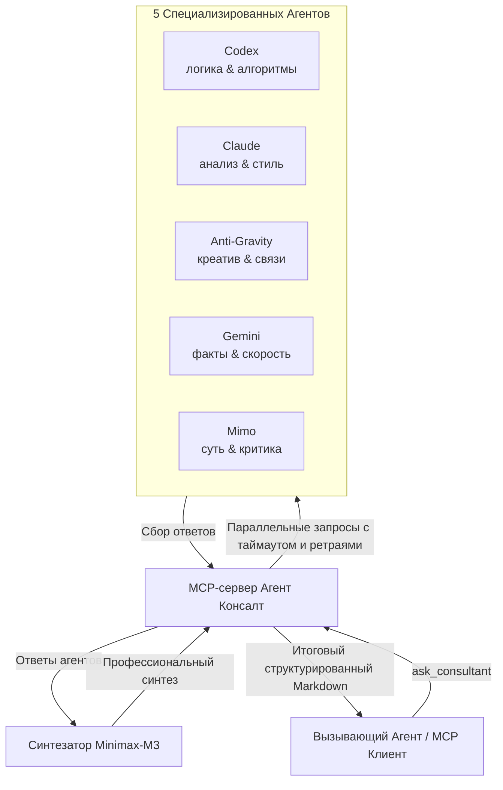

# Агент Консалт (Agent Consult MCP Server)

Полноценный MCP-сервер, реализующий концепцию консилиума из 5 виртуальных агентов (**Codex**, **Claude**, **Anti-Gravity (agy)**, **Gemini**, **Mimo**) с итоговой профессиональной самореализацией (синтезом) ответов через модель **Minimax-M3** на платформе OpenRouter.

Сервер разработан в соответствии с современными стандартами протокола Model Context Protocol (MCP) на базе Node.js (v24+) и TypeScript.

---

## 🛠️ Архитектура системы



---

## 📄 Документация

Для детального ознакомления с архитектурой и принципами работы проекта обратитесь к следующим материалам:
* [docs/architecture.md](docs/architecture.md) — Потоки данных, изолированные домашние папки (Sandbox Isolation) и механизмы авторизации.
* [docs/troubleshooting.md](docs/troubleshooting.md) — Решение проблем, логирование реального времени, Process Groups и динамический таймаут (Liveness Probe).
* [docs/roles_and_mcp_mapping.md](docs/roles_and_mcp_mapping.md) — Полный список ролей специалистов, их фокус и маппинги разрешенных МЦП-серверов.
* [CHANGELOG.md](CHANGELOG.md) — Подробная история изменений и обоснование принятых технических решений.

---

## 📋 Описание инструментов (Tools)

Сервер предоставляет следующие инструменты для вызова:

1. **`ask_consultant`** — Основной инструмент для отправки вопросов.
   - **Параметры**:
     - `question` (string, обязательный): Ваш вопрос или техническое задание.
     - `role` (enum, необязательный, по умолчанию `general`): Выбор специализации для ответа. Доступно: `marketer`, `programmer`, `system_architect`, `app_architect`, `general`.
     - `custom_role_prompt` (string, необязательный): Кастомный системный промпт для роли, переопределяющий стандартный.
     - `agents` (array, необязательный): Список агентов для опроса (например, вы хотите спросить только `["claude", "gemini"]`).
     - `skip_synthesis` (boolean, необязательный, по умолчанию `false`): Позволяет пропустить шаг синтеза через Minimax-M3 и получить только сырые ответы агентов.
2. **`check_agents_status`** — Проверяет жизнеспособность (liveness) подключения к OpenRouter, текущую конфигурацию моделей и настройки таймаутов.
3. **`list_available_roles`** — Возвращает список всех доступных профилей специалистов с описанием их сильных сторон.

---

## ⚙️ Конфигурация (`config.json`)

В корневой директории сервера находится файл [config.json](file:///home/ubuntu/mcp_server/agent_counsult/config.json). Вы можете в любой момент изменить настройки без пересборки проекта:

```json
{
  "openrouter_api_key": "YOUR_OPENROUTER_API_KEY_HERE",
  "timeout_ms": 120000,
  "retry_attempts": 2,
  "agents": {
    "codex": {
      "model": "openai/gpt-4o-mini",
      "system_prefix": "Ты — агент Codex. Твоя сила в алгоритмической точности, глубоком понимании кода...",
      "reasoning": {
        "enable": false,
        "reasoning_effort": "medium"
      }
    },
    ...
  },
  "synthesis": {
    "model": "minimax/minimax-m3",
    "system_prefix": "Ты — Синтезатор Агент Консалт. Проведи профессиональную самореализацию...",
    "reasoning": {
      "enable": false
    }
  }
}
```

### Настройка reasoning (рассуждения):
Для моделей, поддерживающих технологию рассуждения (например, `openai/o3-mini`), вы можете включить параметр `"enable": true` и настроить параметр `"reasoning_effort": "low" | "medium" | "high"`.

> [!NOTE]
> Вы можете задать API-ключ через переменную окружения `OPENROUTER_API_KEY`. Она имеет приоритет над ключом, прописанным в `config.json`.

---

## 📂 Профили специалистов (Роли)

Промпты для ролей вынесены в отдельные markdown-файлы в директории [profiles/](file:///home/ubuntu/mcp_server/agent_counsult/profiles/). Сервер считывает их динамически при каждом запросе, что позволяет редактировать инструкции на лету без перезапуска:

* [profiles/marketer.md](file:///home/ubuntu/mcp_server/agent_counsult/profiles/marketer.md) — Маркетолог-стратег (CJM, JTBD, позиционирование).
* [profiles/programmer.md](file:///home/ubuntu/mcp_server/agent_counsult/profiles/programmer.md) — Профессиональный программист (чистый код, паттерны, рефакторинг).
* [profiles/system_architect.md](file:///home/ubuntu/mcp_server/agent_counsult/profiles/system_architect.md) — Сайт-архитектор (структура страниц, UX, SEO, Core Web Vitals).
* [profiles/app_architect.md](file:///home/ubuntu/mcp_server/agent_counsult/profiles/app_architect.md) — Архитектор приложений (DDD, базы данных, масштабирование).
* [profiles/general.md](file:///home/ubuntu/mcp_server/agent_counsult/profiles/general.md) — Универсальный консультант.

Каждая роль имеет четкую структуру ответа, которую агенты обязаны соблюдать.

---

## ⚡ Отказоустойчивость и Таймауты

Чтобы исключить падение или зависание MCP-сервера при долгих ответах моделей:
1. Запросы к агентам выполняются параллельно с контролируемым таймаутом (по умолчанию `120000 мс` — 2 минуты).
2. При сбое сети или ошибках API (например, лимитах запросов `429`) автоматически срабатывает механизм повторных попыток (retries) с экспоненциальной задержкой.
3. Если конкретный агент полностью зависает или отключается, его ответ заменяется понятным сообщением об ошибке, но **остальные 4 агента продолжают работу и возвращают свои ответы**.
4. Синтез формируется на основе успешно полученных ответов.

---

## 🚀 Как запустить и зарегистрировать

### 1. Подготовка и сборка
В терминале внутри папки `/home/ubuntu/mcp_server/agent_counsult` выполните сборку:
```bash
npm run build
```

### 2. Регистрация в Claude Desktop
Добавьте сервер в ваш конфигурационный файл Claude Desktop (обычно находится в `~/.config/Claude/claude_desktop_config.json` на Linux или `%APPDATA%\Claude\claude_desktop_config.json` на Windows):

```json
{
  "mcpServers": {
    "agent-consult": {
      "command": "node",
      "args": [
        "/home/ubuntu/mcp_server/agent_counsult/dist/index.js"
      ],
      "env": {
        "OPENROUTER_API_KEY": "ВАШ_API_КЛЮЧ_OPENROUTER"
      }
    }
  }
}
```

### 3. Регистрация в Codex CLI (`~/.codex/config.toml`)
```toml
[mcp_servers.agent_consult]
command = "node"
args = ["/home/ubuntu/mcp_server/agent_counsult/dist/index.js"]
startup_timeout_sec = 20
env = { OPENROUTER_API_KEY = "ВАШ_API_КЛЮЧ_OPENROUTER" }
```
