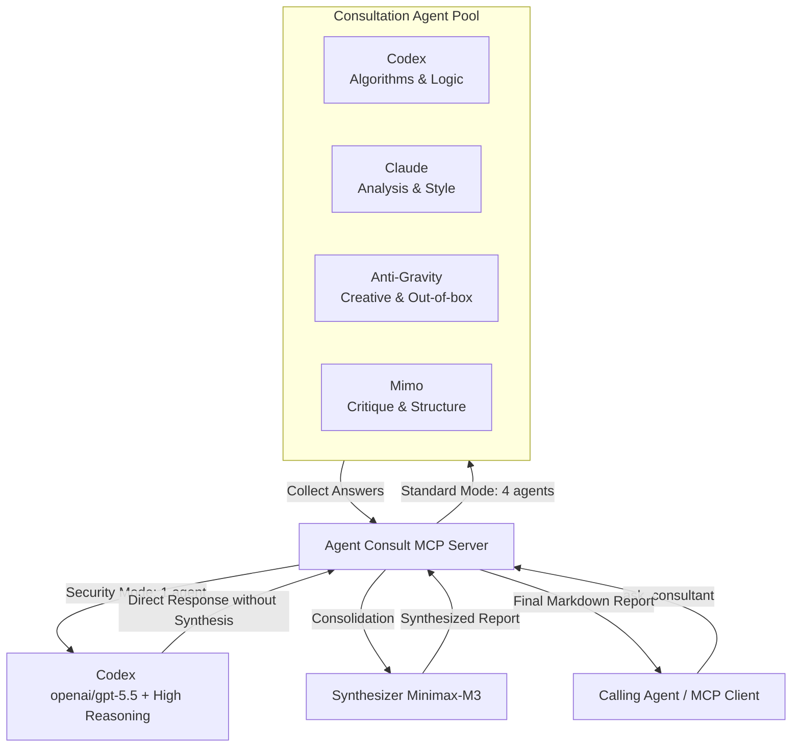

<div align="center">


# Agent Consult MCP Server

**A production-grade Model Context Protocol (MCP) server for running multi-agent AI consultations (Codex, Claude, Anti-Gravity, Mimo) with professional synthesis powered by Minimax-M3 on OpenRouter.**

[](LICENSE)
[](https://nodejs.org)
[](https://modelcontextprotocol.io)
[](https://www.typescriptlang.org/)

[💬 Telegram Channel](https://t.me/pomogay_marketing) · [🇷🇺 Русский](./README.ru.md) · [🇨🇳 中文](./README.zh.md) · [🇪🇸 Español](./README.es.md) · [🇩🇪 Deutsch](./README.de.md)

</div>

---

## 📖 Overview & SEO Description

**Agent Consult MCP Server** is a robust multi-agent orchestration and consensus-building platform built on top of the **Model Context Protocol (MCP)**. It coordinates a panel of virtual experts (**Codex** for logic and code, **Claude** for analysis and writing style, **Anti-Gravity** for creative thinking, and **Mimo** for structural criticism) to deliver a unified, highly optimized professional response. The final synthesis is performed by the advanced **Minimax-M3** model, ensuring technical accuracy, conflict resolution, and cohesive formatting.

Designed for developers, system architects, and marketing strategists, it brings enterprise-grade AI consensus directly to tools like **Claude Desktop**, **Codex CLI**, and other MCP-compatible clients.

---

## 🛠️ System Architecture



For a deep dive into the inner workings, refer to the documentation:
* [docs/architecture.en.md](file:///home/ubuntu/mcp_server/agent_counsult/docs/architecture.en.md) — Data flows, Sandbox Isolation, and security.
* [docs/troubleshooting.en.md](file:///home/ubuntu/mcp_server/agent_counsult/docs/troubleshooting.en.md) — Monitoring, logs, process groups, and Liveness Probe.
* [docs/roles_and_mcp_mapping.en.md](file:///home/ubuntu/mcp_server/agent_counsult/docs/roles_and_mcp_mapping.en.md) — Specialist roles and their mapped MCP tools.

---

## ✨ Key Features

1. **Sandbox Isolation (Security First)**
   - Every local agent runs in its own isolated home directory (`~/.agent-consult/homes/`) with custom environment variables.
   - Credentials and OAuth tokens are copied securely with `0600` permissions.
   - Prevents recursive tool execution loop and leaks.
2. **Dynamic Role-Based MCP Mapping**
   - Agents are equipped with specific tools depending on their active role. Developers get code tools, marketers get search tools, and architects get database tools.
3. **Consensus Synthesis (Minimax-M3)**
   - Resolves contradictions between different models.
   - Aggregates ideas and outputs a professional, structured Markdown report.
4. **Liveness Probe & Resilience**
   - Multi-agent requests execute in parallel with a configurable timeout.
   - If one agent hangs or crashes, it is gracefully handled while the others finish the job.
   - A liveness probe dynamically extends timeouts for heavy reasoning models if active work is detected.

---

## 📋 MCP Tools Reference

The server exposes the following tools:

### 1. `ask_consultant`
Run a multi-agent consultation to answer a complex prompt or task.
* **Arguments**:
  - `question` (string, **required**): Your question or technical task description.
  - `role` (enum, optional, default: `general`): Specialist profile. Available: `marketer`, `programmer`, `system_architect`, `web_architect`, `app_architect`, `security_auditor`, `qa_engineer`, `data_engineer`, `general`.
  - `custom_role_prompt` (string, optional): Overrides the default system prompt for the role.
  - `agents` (string[], optional): Sub-list of agents to query (e.g., `["codex", "claude"]`). Defaults to `["codex", "claude", "agy", "mimo"]`.
  - `skip_synthesis` (boolean, optional, default: `false`): Skips the consolidation phase and returns raw agent responses.

### 2. `check_agents_status`
Verifies connection to OpenRouter, checks current agent status, and returns network latencies.

### 3. `list_available_roles`
Returns the list of all configured roles with their descriptions.

---

## ⚙️ Configuration (`config.json`)

The server configuration resides in [config.json](file:///home/ubuntu/mcp_server/agent_counsult/config.json). You can modify it on the fly:

```json
{
  "openrouter_api_key": "YOUR_OPENROUTER_API_KEY_HERE",
  "timeout_ms": 240000,
  "retry_attempts": 2,
  "agents": {
    "codex": {
      "model": "openai/gpt-5.5",
      "system_prefix": "You are Codex. Your strength is in algorithmic precision and code analysis...",
      "reasoning": {
        "enable": false,
        "reasoning_effort": "medium"
      }
    }
  },
  "synthesis": {
    "model": "minimax/minimax-m3",
    "system_prefix": "You are the Synthesis Engine. Synthesize the following expert reports...",
    "reasoning": {
      "enable": false
    }
  }
}
```

> [!TIP]
> You can also set the API key via the `OPENROUTER_API_KEY` environment variable. It takes precedence over the `config.json` value.

---

## 📂 Specialist Role Profiles

Role prompts are located in the [profiles/](file:///home/ubuntu/mcp_server/agent_counsult/profiles/) folder. They are read dynamically on each request:

* [profiles/marketer.md](file:///home/ubuntu/mcp_server/agent_counsult/profiles/marketer.md) — Strategic marketing & JTBD.
* [profiles/programmer.md](file:///home/ubuntu/mcp_server/agent_counsult/profiles/programmer.md) — Clean code & refactoring patterns.
* [profiles/web_architect.md](file:///home/ubuntu/mcp_server/agent_counsult/profiles/web_architect.md) — Frontend architecture, UX, accessibility, and SEO.
* [profiles/app_architect.md](file:///home/ubuntu/mcp_server/agent_counsult/profiles/app_architect.md) — Distributed systems, DDD, databases, and scalability.
* [profiles/security_auditor.md](file:///home/ubuntu/mcp_server/agent_counsult/profiles/security_auditor.md) — OWASP Top 10 vulnerabilities auditor (runs in single High-Reasoning mode).
* [profiles/qa_engineer.md](file:///home/ubuntu/mcp_server/agent_counsult/profiles/qa_engineer.md) — QA planning, edge cases, and test suites.
* [profiles/data_engineer.md](file:///home/ubuntu/mcp_server/agent_counsult/profiles/data_engineer.md) — OLAP/OLTP databases, ETL pipelines, and SQL indexing.
* [profiles/general.md](file:///home/ubuntu/mcp_server/agent_counsult/profiles/general.md) — General consultant.

---

## 🛡️ Security Auditor Mode & DevSecOps Tools

The server includes a specialized **Security Auditor (`security_auditor`)** mode designed for static/dynamic code analysis, vulnerability scanning, and secure architecture modeling:

* **Single High-Reasoning Execution**: When the `security_auditor` role is selected, the server automatically bypasses multi-agent polling and consensus synthesis. It queries a single local **Codex** agent running the state-of-the-art `openai/gpt-5.5` model with maximum reasoning settings (`reasoning_effort: "high"`).
* **Supply Chain & SAST/DAST Integration**: The agent is equipped with special DevSecOps tools:
  - **`sentinel`**: Orchestrates security tools such as **Trivy** (for scanning dependencies/container images), **Semgrep** (Static Application Security Testing - SAST), and **OWASP ZAP** (Dynamic Application Security Testing - DAST) under a single interface.
  - **`skylos`**: Detects hardcoded secrets, API tokens, and vulnerabilities (taint analysis) for JavaScript, TypeScript, Python, and Go codebases.
* **Testing Security Auditor**: You can run the integrated DevSecOps audit test using:
  ```bash
  node dist/test-security-auditor.js
  ```

---

## 🚀 Installation & Quick Start

### 1. Clone & Build
Ensure you have Node.js v20+ and npm installed:
```bash
git clone https://github.com/VKirill/agent-consult.git
cd agent-consult
npm install
npm run build
```

### 2. Integration with Claude Desktop
Add the server to your Claude Desktop config (located at `~/.config/Claude/claude_desktop_config.json` on Linux/macOS or `%APPDATA%\Claude\claude_desktop_config.json` on Windows):

```json
{
  "mcpServers": {
    "agent-consult": {
      "command": "node",
      "args": [
        "/absolute/path/to/agent-consult/dist/index.js"
      ],
      "env": {
        "OPENROUTER_API_KEY": "YOUR_OPENROUTER_API_KEY"
      }
    }
  }
}
```

### 3. Integration with Codex CLI (`~/.codex/config.toml`)
```toml
[mcp_servers.agent_consult]
command = "node"
args = ["/absolute/path/to/agent-consult/dist/index.js"]
startup_timeout_sec = 20
env = { OPENROUTER_API_KEY = "YOUR_OPENROUTER_API_KEY" }
```

---

## 👨‍💻 Developer & Author

* **Author**: [Kirill Vechkasov](https://github.com/VKirill)
* **Telegram Channel**: [t.me/pomogay_marketing](https://t.me/pomogay_marketing) — Join for updates on AI agents, automation, and tech marketing.

---

## 📄 License

This project is licensed under the MIT License — see the LICENSE file for details.
