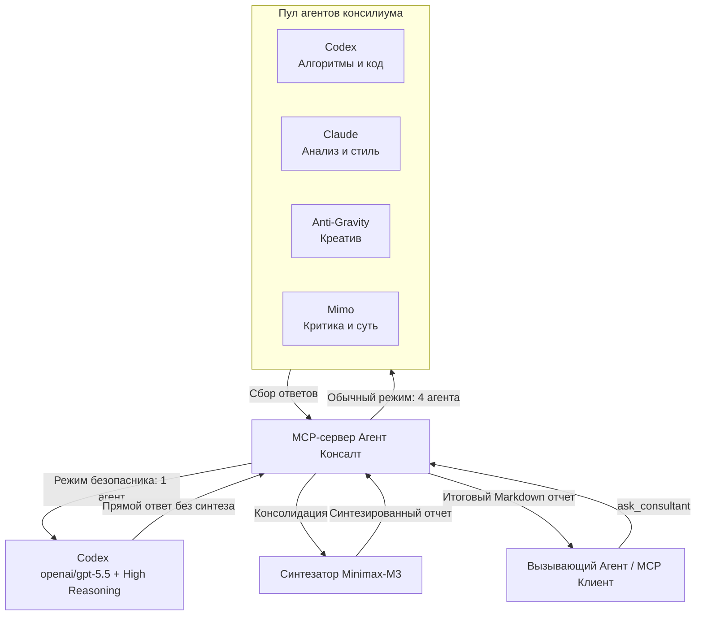

<div align="center">


# Агент Консалт (Agent Consult MCP Server)

**Полноценный MCP-сервер для совместных ИИ-консилиумов (Codex, Claude, Anti-Gravity, Mimo) с профессиональным синтезом ответов через модель Minimax-M3 на платформе OpenRouter.**

[](LICENSE)
[](https://nodejs.org)
[](https://modelcontextprotocol.io)
[](https://www.typescriptlang.org/)

[💬 Телеграм-канал](https://t.me/pomogay_marketing) · [🇬🇧 English](./README.md) · [🇨🇳 中文](./README.zh.md) · [🇪🇸 Español](./README.es.md) · [🇩🇪 Deutsch](./README.de.md)

</div>

---

## 📖 Обзор проекта и SEO-описание

**Агент Консалт** — это надежная платформа для оркестрации мультиагентных систем и синтеза консенсуса, разработанная на базе протокола **Model Context Protocol (MCP)**. Сервер координирует работу панели ИИ-экспертов (**Codex** — алгоритмы и код, **Claude** — анализ и стиль текста, **Anti-Gravity** — нестандартные креативные решения, **Mimo** — конструктивная критика и структура), предоставляя единый, профессионально структурированный Markdown-отчет. Итоговый синтез выполняет передовая модель **Minimax-M3**, обеспечивая техническую точность, устранение логических противоречий и читаемость.

Проект идеально подходит для веб-архитекторов, программистов, аналитиков данных и маркетологов, которым требуется экспертная оценка сложных технических решений и маркетинговых гипотез непосредственно в консольных агентах (**Codex CLI**) или десктопных клиентах (**Claude Desktop**).

---

## 🛠️ Архитектура системы



Для детального ознакомления с архитектурой и принципами работы проекта обратитесь к документации:
* [docs/architecture.md](file:///home/ubuntu/mcp_server/agent_counsult/docs/architecture.md) — Потоки данных, изолированные домашние папки (Sandbox Isolation) и механизмы авторизации.
* [docs/troubleshooting.md](file:///home/ubuntu/mcp_server/agent_counsult/docs/troubleshooting.md) — Решение проблем, логирование реального времени, Process Groups и динамический таймаут (Liveness Probe).
* [docs/roles_and_mcp_mapping.md](file:///home/ubuntu/mcp_server/agent_counsult/docs/roles_and_mcp_mapping.md) — Полный список ролей специалистов, их фокус и маппинги разрешенных МЦП-серверов.
* [CHANGELOG.md](file:///home/ubuntu/mcp_server/agent_counsult/CHANGELOG.md) — Подробная история изменений и обоснование принятых технических решений.

---

## ✨ Основные возможности

1. **Изоляция окружения (Sandbox Isolation)**
   - Каждый локальный ИИ-агент работает в собственной изолированной директории (`~/.agent-consult/homes/`) с чистым файлом настроек.
   - Авторизационные токены безопасно копируются с правами `0600`, предотвращая несанкционированный доступ и цикличные вызовы инструментов.
2. **Динамический ролевой маппинг MCP**
   - Дочерним агентам подключается строго определенный набор МЦП-инструментов в зависимости от выбранной роли (разработчики получают доступ к репозиторию, маркетологи — к поиску, системные архитекторы — к БД).
3. **Консолидация и Синтез (Synthesis)**
   - Модель **Minimax-M3** выступает профессиональным модератором: выявляет уникальные идеи экспертов, устраняет противоречия и формирует единый красивый Markdown-документ.
4. **Отказоустойчивость и Liveness Probe**
   - Запросы к агентам выполняются параллельно. При сбое или зависании одного из них сервер продолжит работу с остальными.
   - Механизм динамического пульса продлевает время ожидания для ресурсоемких моделей-рассуждателей.

---

## 📋 Описание инструментов (Tools)

Сервер предоставляет следующие инструменты:

### 1. `ask_consultant`
Запуск мультиагентного консилиума для ответа на сложный технический или маркетинговый вопрос.
* **Параметры**:
  - `question` (string, **обязательный**): Ваш вопрос или описание технического задания.
  - `role` (enum, необязательный, по умолчанию `general`): Выбор специализации для ответа. Доступно: `marketer`, `programmer`, `system_architect`, `web_architect`, `app_architect`, `security_auditor`, `qa_engineer`, `data_engineer`, `general`.
  - `custom_role_prompt` (string, необязательный): Кастомный системный промпт для роли, переопределяющий стандартный.
  - `agents` (array, необязательный): Список агентов для опроса (например, `["codex", "claude"]`). По умолчанию `["codex", "claude", "agy", "mimo"]`.
  - `skip_synthesis` (boolean, необязательный, по умолчанию `false`): Позволяет пропустить шаг синтеза и получить только сырые ответы агентов.

### 2. `check_agents_status`
Проверяет жизнеспособность подключения к OpenRouter, текущую конфигурацию моделей и настройки таймаутов.

### 3. `list_available_roles`
Возвращает список всех доступных профилей специалистов с описанием их сильных сторон.

---

## ⚙️ Конфигурация (`config.json`)

В корневой директории находится файл [config.json](file:///home/ubuntu/mcp_server/agent_counsult/config.json). Вы можете в любой момент изменить настройки без пересборки проекта:

```json
{
  "openrouter_api_key": "YOUR_OPENROUTER_API_KEY_HERE",
  "timeout_ms": 240000,
  "retry_attempts": 2,
  "agents": {
    "codex": {
      "model": "openai/gpt-5.5",
      "system_prefix": "Ты — агент Codex. Твоя сила в алгоритмической точности, глубоком понимании кода...",
      "reasoning": {
        "enable": false,
        "reasoning_effort": "medium"
      }
    }
  },
  "synthesis": {
    "model": "minimax/minimax-m3",
    "system_prefix": "Ты — Синтезатор Агент Консалт. Проведи профессиональную самореализацию...",
    "reasoning": {
      "enable": false
    }
  }
}
```

> [!NOTE]
> Вы можете задать API-ключ через переменную окружения `OPENROUTER_API_KEY`. Она имеет приоритет над ключом, прописанным в `config.json`.

---

## 📂 Профили специалистов (Роли)

Промпты для ролей вынесены в отдельные markdown-файлы в директории [profiles/](file:///home/ubuntu/mcp_server/agent_counsult/profiles/):

* [profiles/marketer.md](file:///home/ubuntu/mcp_server/agent_counsult/profiles/marketer.md) — Маркетолог-стратег (CJM, JTBD, позиционирование).
* [profiles/programmer.md](file:///home/ubuntu/mcp_server/agent_counsult/profiles/programmer.md) — Профессиональный программист (чистый код, паттерны, рефакторинг).
* [profiles/web_architect.md](file:///home/ubuntu/mcp_server/agent_counsult/profiles/web_architect.md) — Веб-архитектор (структура страниц, UX, SEO, Core Web Vitals).
* [profiles/app_architect.md](file:///home/ubuntu/mcp_server/agent_counsult/profiles/app_architect.md) — Архитектор сложных приложений (DDD, базы данных, масштабирование).
* [profiles/security_auditor.md](file:///home/ubuntu/mcp_server/agent_counsult/profiles/security_auditor.md) — Аудитор безопасности (OWASP Top 10, одиночный запуск High Reasoning).
* [profiles/qa_engineer.md](file:///home/ubuntu/mcp_server/agent_counsult/profiles/qa_engineer.md) — Инженер по качеству (тест-планы, edge cases, Playwright, Vitest).
* [profiles/data_engineer.md](file:///home/ubuntu/mcp_server/agent_counsult/profiles/data_engineer.md) — Инженер данных (ETL, SQL-оптимизация, OLAP/OLTP).
* [profiles/general.md](file:///home/ubuntu/mcp_server/agent_counsult/profiles/general.md) — Универсальный консультант.

---

## 🚀 Как запустить и зарегистрировать

### 1. Подготовка и сборка
Убедитесь, что у вас установлен Node.js v20+ и npm:
```bash
git clone https://github.com/VKirill/agent-consult.git
cd agent-consult
npm install
npm run build
```

### 2. Регистрация в Claude Desktop
Добавьте сервер в конфигурационный файл Claude Desktop (обычно находится в `~/.config/Claude/claude_desktop_config.json` на Linux/macOS или `%APPDATA%\Claude\claude_desktop_config.json` на Windows):

```json
{
  "mcpServers": {
    "agent-consult": {
      "command": "node",
      "args": [
        "/absolute/path/to/agent-consult/dist/index.js"
      ],
      "env": {
        "OPENROUTER_API_KEY": "ВАШ_API_КЛЮЧ_OPENROUTER"
      }
    }
  }
}
```

### 3. Регистрация в Codex CLI (`~/.codex/config.toml`)
```toml
[mcp_servers.agent_consult]
command = "node"
args = ["/absolute/path/to/agent-consult/dist/index.js"]
startup_timeout_sec = 20
env = { OPENROUTER_API_KEY = "ВАШ_API_КЛЮЧ_OPENROUTER" }
```

---

## 👨‍💻 Разработчик и автор

* **Автор**: [Кирилл Вечкасов](https://github.com/VKirill)
* **Телеграм-канал**: [t.me/pomogay_marketing](https://t.me/pomogay_marketing) — Подписывайтесь, чтобы следить за развитием ИИ-агентов, автоматизацией процессов и технологическим маркетингом.

---

## 📄 Лицензия

Этот проект распространяется под лицензией MIT. Подробности см. в файле LICENSE.
