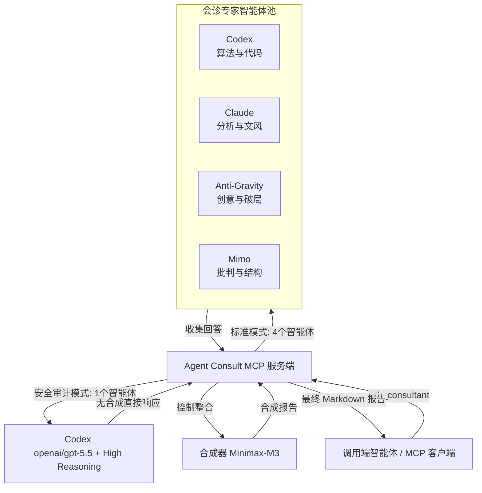

<div align="center">


# Agent Consult MCP 服务端

**一个生产级别的 Model Context Protocol (MCP) 服务端，支持运行多智能体 AI 会诊（Codex、Claude、Anti-Gravity、Mimo），并由 OpenRouter 上的 Minimax-M3 模型提供专业的解答整合与合成。**

[](LICENSE)
[](https://nodejs.org)
[](https://modelcontextprotocol.io)
[](https://www.typescriptlang.org/)

[💬 Telegram 频道](https://t.me/pomogay_marketing) · [🇬🇧 English](./README.md) · [🇷🇺 Русский](./README.ru.md) · [🇪🇸 Español](./README.es.md) · [🇩🇪 Deutsch](./README.de.md)

</div>

---

## 📖 项目概述与 SEO 描述

**Agent Consult MCP Server** 是一个基于 **Model Context Protocol (MCP)** 构建的强大智能体编排与共识平台。它协调一组虚拟专家智能体（负责逻辑和代码的 **Codex**、负责分析和写作风格的 **Claude**、负责创新思维的 **Anti-Gravity** 以及负责结构化批判的 **Mimo**）来提供一个统一且高度优化的专业答复。最终的合成由先进的 **Minimax-M3** 模型执行，确保技术准确性、矛盾消除和一致的 Markdown 格式输出。

本项目专为开发者、系统架构师和营销策略师设计，将企业级的 AI 共识机制直接引入 **Claude Desktop**、**Codex CLI** 以及其他兼容 MCP 的客户端中。

---

## 🛠️ 系统架构



如需深入了解内部工作原理，请参考以下文档：
* [docs/architecture.en.md](file:///home/ubuntu/mcp_server/agent_counsult/docs/architecture.en.md) — 数据流、沙箱隔离与安全性（英文）。
* [docs/troubleshooting.en.md](file:///home/ubuntu/mcp_server/agent_counsult/docs/troubleshooting.en.md) — 监控、日志、进程组和 Liveness Probe（英文）。
* [docs/roles_and_mcp_mapping.en.md](file:///home/ubuntu/mcp_server/agent_counsult/docs/roles_and_mcp_mapping.en.md) — 专家角色及其映射的 MCP 工具（英文）。

---

## ✨ 核心特性

1. **沙箱隔离（安全至上）**
   - 每个本地智能体都在其独立的家目录（`~/.agent-consult/homes/`）中运行，并带有自定义环境变量。
   - 凭证和 OAuth 令牌以 `0600` 权限安全复制，防止递归工具执行环和数据泄露。
2. **动态基于角色的 MCP 工具映射**
   - 智能体根据其当前激活的角色配备特定的 MCP 工具。开发人员获取代码工具，市场人员获取搜索工具，架构师获取数据库工具。
3. **共识合成（Minimax-M3）**
   - 消除不同模型之间的技术和逻辑矛盾。
   - 汇总思路，生成清晰、专业、结构化的 Markdown 报告。
4. **Liveness Probe & 容错机制**
   - 多智能体请求并行执行，并具有可配置的超时限制。
   - 如果某个智能体挂起或崩溃，服务端将优雅处理，同时保证其他智能体继续完成工作。
   - 动态脉冲探针（Liveness Probe）会在检测到正在进行复杂推理时，自动延长重推理模型的超时限制。

---

## 📋 MCP 工具参考

服务端暴露了以下工具：

### 1. `ask_consultant`
运行多智能体会诊，回答复杂的提示词或技术任务。
* **参数**:
  - `question` (string, **必填**): 您的提问或技术任务描述。
  - `role` (enum, 选填, 默认: `general`): 专家角色配置文件。可用值: `marketer`, `programmer`, `system_architect`, `web_architect`, `app_architect`, `security_auditor`, `qa_engineer`, `data_engineer`, `general`。
  - `custom_role_prompt` (string, 选填): 覆盖该角色的默认系统提示词。
  - `agents` (string[], 选填): 要查询的智能体子列表（例如 `["codex", "claude"]`）。默认值为 `["codex", "claude", "agy", "mimo"]`。
  - `skip_synthesis` (boolean, 选填, 默认: `false`): 跳过整合阶段，直接返回智能体的原始响应。

### 2. `check_agents_status`
验证与 OpenRouter 的连接，检查当前智能体状态，并返回网络延迟。

### 3. `list_available_roles`
返回所有已配置的角色及其描述列表。

---

## ⚙️ 配置方式 (`config.json`)

服务端配置位于 [config.json](file:///home/ubuntu/mcp_server/agent_counsult/config.json)。您可以实时修改它：

```json
{
  "openrouter_api_key": "YOUR_OPENROUTER_API_KEY_HERE",
  "timeout_ms": 240000,
  "retry_attempts": 2,
  "agents": {
    "codex": {
      "model": "openai/gpt-5.5",
      "system_prefix": "You are Codex. Your strength is in algorithmic precision and code analysis...",
      "reasoning": {
        "enable": false,
        "reasoning_effort": "medium"
      }
    }
  },
  "synthesis": {
    "model": "minimax/minimax-m3",
    "system_prefix": "You are the Synthesis Engine. Synthesize the following expert reports...",
    "reasoning": {
      "enable": false
    }
  }
}
```

> [!TIP]
> 您也可以通过环境变量 `OPENROUTER_API_KEY` 来设置 API 密钥。它的优先级高于 `config.json` 中的值。

---

## 📂 专家角色配置文件

角色提示词文件位于 [profiles/](file:///home/ubuntu/mcp_server/agent_counsult/profiles/) 文件夹。每次请求时动态读取：

* [profiles/marketer.md](file:///home/ubuntu/mcp_server/agent_counsult/profiles/marketer.md) — 战略市场营销与 JTBD。
* [profiles/programmer.md](file:///home/ubuntu/mcp_server/agent_counsult/profiles/programmer.md) — 干净代码与重构模式。
* [profiles/web_architect.md](file:///home/ubuntu/mcp_server/agent_counsult/profiles/web_architect.md) — 前端架构、UX、可访问性和 SEO。
* [profiles/app_architect.md](file:///home/ubuntu/mcp_server/agent_counsult/profiles/app_architect.md) — 分布式系统、DDD、数据库与可扩展性。
* [profiles/security_auditor.md](file:///home/ubuntu/mcp_server/agent_counsult/profiles/security_auditor.md) — OWASP Top 10 漏洞审计员（在单一高推理模式下运行）。
* [profiles/qa_engineer.md](file:///home/ubuntu/mcp_server/agent_counsult/profiles/qa_engineer.md) — QA 规划、边缘情况与测试套件。
* [profiles/data_engineer.md](file:///home/ubuntu/mcp_server/agent_counsult/profiles/data_engineer.md) — OLAP/OLTP 数据库、ETL 管道与 SQL 索引。
* [profiles/general.md](file:///home/ubuntu/mcp_server/agent_counsult/profiles/general.md) — 通用顾问。

---

## 🚀 安装与快速开始

### 1. 克隆与构建
确保您已安装 Node.js v20+ 和 npm：
```bash
git clone https://github.com/VKirill/agent-consult.git
cd agent-consult
npm install
npm run build
```

### 2. 在 Claude Desktop 中集成
将该服务端添加到您的 Claude Desktop 配置中（通常位于 Linux/macOS 的 `~/.config/Claude/claude_desktop_config.json` 或 Windows 的 `%APPDATA%\Claude\claude_desktop_config.json`）：

```json
{
  "mcpServers": {
    "agent-consult": {
      "command": "node",
      "args": [
        "/absolute/path/to/agent-consult/dist/index.js"
      ],
      "env": {
        "OPENROUTER_API_KEY": "YOUR_OPENROUTER_API_KEY"
      }
    }
  }
}
```

### 3. 在 Codex CLI 中集成 (`~/.codex/config.toml`)
```toml
[mcp_servers.agent_consult]
command = "node"
args = ["/absolute/path/to/agent-consult/dist/index.js"]
startup_timeout_sec = 20
env = { OPENROUTER_API_KEY = "YOUR_OPENROUTER_API_KEY" }
```

---

## 👨‍💻 开发者与作者

* **作者**: [Kirill Vechkasov](https://github.com/VKirill)
* **Telegram 频道**: [t.me/pomogay_marketing](https://t.me/pomogay_marketing) — 加入以获取有关 AI 智能体、自动化和技术营销的最新动态。

---

## 📄 开源许可

本项目采用 MIT 许可协议进行许可 — 详情请参阅 LICENSE 文件。
