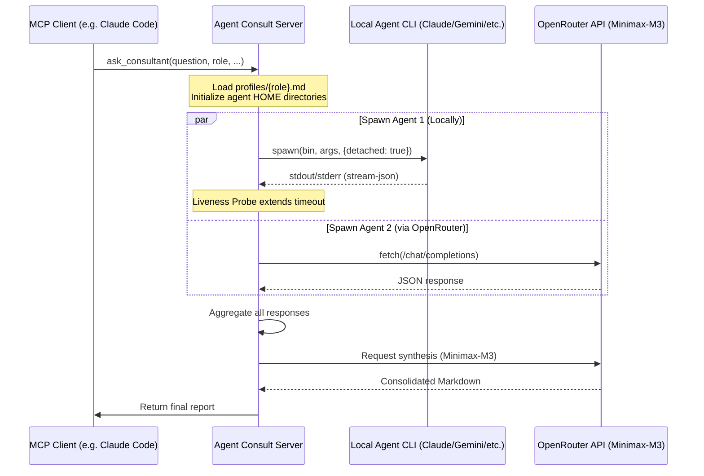

# Architectural Description of Agent Consult

This document provides a detailed description of the architecture, data flows, isolation mechanisms, and configuration of the **Agent Consult** MCP server.

---

## 1. Overall Execution Flow

The system operates based on the following sequence:



---

## 2. Sandbox Isolation (Security First)

To prevent local AI agents (`claude`, `codex`, `mimo`, `agy`, `gemini`) from conflicting with each other, overwriting global user settings, or accessing global MCP servers (optimizing context size and security), the server implements **Sandbox Isolation**:

1. **Root Folder**: All agent home directories are created under the user's home folder:
   `~/.agent-consult/homes/` (with directory permissions set to `0700` on Unix systems).
2. **Individual HOME**: Each agent is assigned its own home directory (e.g., `~/.agent-consult/homes/claude/` for the Claude agent).
3. **Authentication Tokens**: Upon server startup, authentication files (OAuth tokens, credentials) are copied securely from the global `${HOME}` folder to the corresponding isolated agent home folder with strict `0600` permissions.
4. **Configuration `.claude.json` / `settings.json`**:
   A clean configuration file is generated for each agent, with global MCP server inheritance disabled (`inheritUser: false`). The agent is registered with only the specific tools allowed for its active role as defined in `ROLE_MCP_MAPPING`.

---

## 3. Dynamic Role-Based MCP Mapping (config.ts)

Sub-agents are equipped with a strictly defined set of MCP tools depending on the chosen role in the consultation. This prevents redundant model calls and eliminates context size inflation. The mapping is defined in [src/config.ts](file:///home/ubuntu/mcp_server/agent_counsult/src/config.ts):

```typescript
const ROLE_MCP_MAPPING: Record<string, string[]> = {
  programmer: ["gitnexus", "repowise", "context7"],
  web_architect: ["gitnexus", "repowise", "vue-docs", "shadcn", "nuxt-ui", "context7"],
  system_architect: ["gitnexus", "repowise", "postgres"],
  app_architect: ["gitnexus", "repowise", "postgres", "context7"],
  marketer: ["perplexity"],
  security_auditor: ["gitnexus", "repowise", "perplexity", "sentinel", "skylos"],
  qa_engineer: ["gitnexus", "repowise"],
  data_engineer: ["gitnexus", "repowise", "postgres"],
  general: ["gitnexus", "repowise", "context7"]
};
```

---

## 4. Consolidation & Synthesis

Once the parallel query of all selected agents finishes, the server forwards the original prompt and the raw agent responses to the **Minimax-M3** synthesizer model via OpenRouter.
The synthesizer acts as a professional moderator:
* Identifies unique ideas and strengths of each expert.
* Resolves technical contradictions between reports.
* Structures the information into a single, logically consistent Markdown document that is easy to read.
