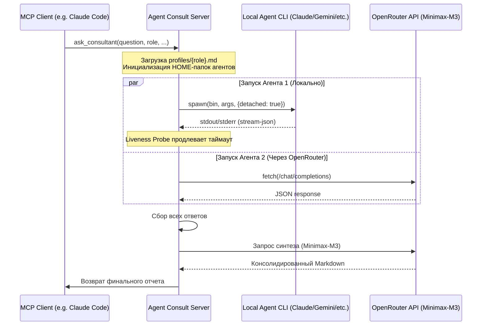

# Архитектурное описание Агент Консалт (Agent Consult)

В данном документе приведено детальное описание архитектуры, потоков данных, а также механизмов изоляции и настройки MCP-сервера «Агент Консалт».

---

## 1. Общий поток выполнения (Flow)

Работа системы строится по следующему алгоритму:



---

## 2. Изолированные домашние папки (Sandbox Isolation)

Для того чтобы локальные ИИ-агенты (`claude`, `codex`, `mimo`, `agy`, `gemini`) не конфликтовали между собой, не перезаписывали глобальные настройки пользователя и не имели доступа к глобальным MCP-серверам (для экономии токенов и безопасности), сервер реализует механизм **Sandbox Isolation**:

1. **Корневая папка**: Все домашние папки агентов создаются в директории пользователя:
   `~/.agent-consult/homes/` (права доступа `0700` на Unix).
2. **Индивидуальный HOME**: Каждому агенту назначается своя домашняя папка (например, `~/.agent-consult/homes/claude/` для Claude).
3. **Авторизационные токены**: При запуске сервера файлы авторизации (OAuth-токены, credentials) безопасно копируются из глобального `${HOME}` в соответствующую изолированную домашнюю папку с жесткими правами `0600`.
4. **Конфигурация `.claude.json` / `settings.json`**:
   Для каждого агента генерируется собственный чистый файл настроек, где отключено наследование глобальных MCP-серверов (`inheritUser: false`). Агенту подключаются строго разрешенные для его роли инструменты согласно `ROLE_MCP_MAPPING`.

---

## 3. Динамический ролевой маппинг MCP (config.ts)

Дочерним агентам подключается строго определенный набор МЦП-инструментов в зависимости от выбранной роли консилиума. Это предотвращает избыточные вызовы моделей и исключает конфликты контекстов. Маппинг определен в `src/config.ts`:

```typescript
const ROLE_MCP_MAPPING: Record<string, string[]> = {
  programmer: ["gitnexus", "repowise", "context7"],
  web_architect: ["gitnexus", "repowise", "vue-docs", "shadcn", "nuxt-ui", "context7"],
  system_architect: ["gitnexus", "repowise", "postgres"],
  app_architect: ["gitnexus", "repowise", "postgres", "context7"],
  marketer: ["perplexity"],
  security_auditor: ["gitnexus", "repowise", "perplexity", "sentinel", "skylos"],
  qa_engineer: ["gitnexus", "repowise"],
  data_engineer: ["gitnexus", "repowise", "postgres"],
  general: ["gitnexus", "repowise", "context7"]
};
```

---

## 4. Консолидация и Синтез (Synthesis)

После завершения параллельного опроса всех выбранных агентов, сервер отправляет исходный вопрос и сырые ответы агентов в модель-синтезатор **Minimax-M3** через OpenRouter. 
Синтезатор выполняет роль профессионального модератора:
* Выявляет уникальные идеи каждого эксперта.
* Устраняет технические противоречия.
* Структурирует информацию в виде единого, логически последовательного Markdown-документа, удобного для восприятия.
